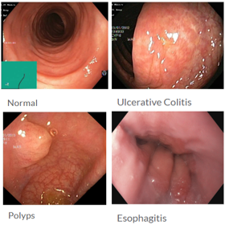
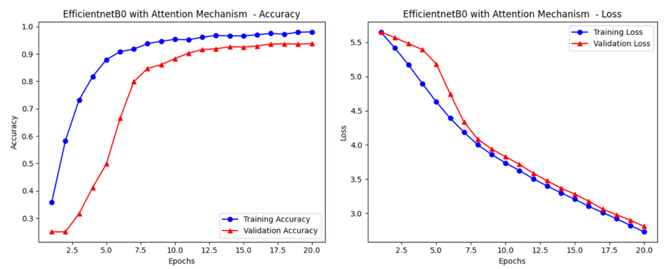
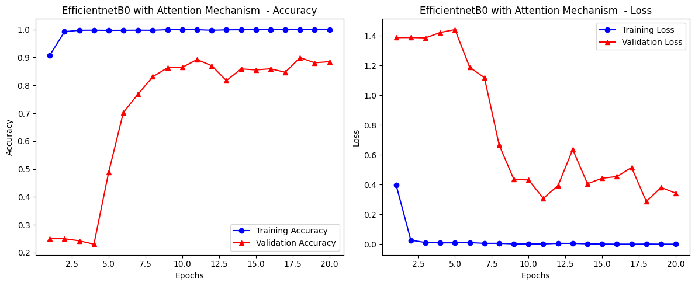
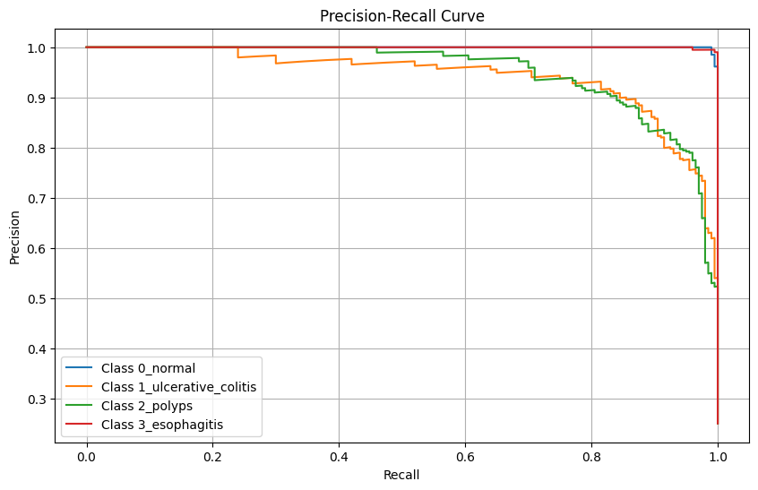
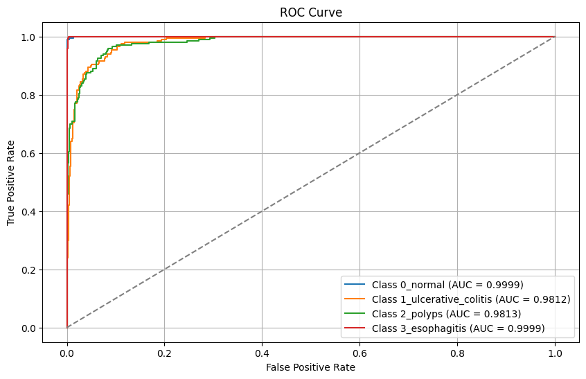

# Endoscopy Image Classification — EfficientNet + Attention Models

> Deep learning experiments for endoscopy image classification.  
> Final release: **`efficientNetB0_attention_regularization(proposed_model).ipynb`** (Colab-friendly).

---

## 📂 Repository Contents

This repository contains multiple Jupyter notebooks exploring baseline and advanced CNN architectures.

| Notebook                                                        | Description                                                                                                                          |
| --------------------------------------------------------------- | ------------------------------------------------------------------------------------------------------------------------------------ |
| `efficientNetB0_attention_regularization(proposed_model).ipynb` | ✅ **Final proposed model** — EfficientNetB0 + SE attention + regularization (L2, Dropout). Best performance (~93.7% test accuracy). |
| `efficientNetB0.ipynb`                                          | Baseline EfficientNetB0 (ImageNet pretrained, no attention, minimal regularization).                                                 |
| `efficientNetB0_with_attention.ipynb`                           | EfficientNetB0 + SE attention block (no additional regularization).                                                                  |
| `efficientNetB2.ipynb`                                          | EfficientNetB2 backbone, deeper and more complex variant.                                                                            |
| `efficientNetB2_with_CNN.ipynb`                                 | Hybrid model: EfficientNetB2 + extra CNN layers.                                                                                     |
| `simple_cnn.ipynb`                                              | Simple CNN baseline for comparison.                                                                                                  |

---

## 🔍 Overview

This project builds a **computationally efficient** classifier for GI endoscopy images.  
The final model integrates:

- **EfficientNetB0** (ImageNet pre-trained) backbone
- **Channel attention (SE block)** for reweighting informative channels
- **Regularization** (L2 + Dropout) for generalization

---

## 🗂️ Dataset

- **Source**: WCE curated colon disease dataset (Kaggle, 2021).
- **Classes used**: `normal`, `esophagitis`, `ulcerative_colitis`, `polyps`
- **Total images**: 6,000 (≈1,500 per class)
- **Split**: `train` ≈ 53%, `val` ≈ 33%, `test` ≈ 13%
- **Input size**: 224×224

### Example Samples



---

## 🧠 Model Architectures

### EfficientNetB0 Backbone


### Squeeze-and-Excitation Attention Module


---

## ⚙️ Training Setup

- **Framework**: TensorFlow / Keras
- **Image size**: 224×224, **batch**: 32
- **Augmentation**: rotation, shifts, shear, zoom, horizontal flip, rescale=1/255
- **Optimizer**: Adam (`1e-5` for proposed, some baselines `1e-4`)
- **Loss**: categorical cross-entropy
- **Regularization**: L2=0.01, Dropout=0.5
- **Epochs**: 20

---

## 📈 Training Performance

### Accuracy & Loss (general training)



### Overfitting Behavior



---

## 📉 Evaluation Metrics

### Precision–Recall Curve



### ROC Curve



---

## 📊 Performance Summary

| Model                                     | Attention | Regularization | Test Accuracy |
| ----------------------------------------- | --------- | -------------- | ------------- |
| Simple CNN                                | ❌        | Dropout        | ~70%          |
| EfficientNetB0 baseline                   | ❌        | Minimal        | ~82%          |
| EfficientNetB0 + SE                       | ✅        | ❌             | ~85%          |
| EfficientNetB2                            | ❌        | Minimal        | ~84%          |
| EfficientNetB2 + CNN layers               | ❌        | Basic dropout  | ~86%          |
| **EfficientNetB0 + SE + Reg. (Proposed)** | ✅        | L2 + Dropout   | **~93.7%**    |


---

## 🚀 Quickstart

### Option A — Run on Google Colab

1. Open any notebook in Colab.
2. Mount your drive.
3. Place dataset in the expected path (or update `flow_from_directory()`).
4. Run all cells.

**Colab badge (replace `<your-repo>`):**

```
[](https://colab.research.google.com/github/<your-username>/<your-repo>/blob/main/efficientNetB0_attention_regularization(proposed_model).ipynb)
```

### Option B — Local

```bash
python -m venv .venv && source .venv/bin/activate   # Windows: .venv\Scripts\activate
pip install "tensorflow==2.16.1" "keras" "scikit-learn" "matplotlib" "numpy"
pip install notebook
jupyter notebook
```

---

## 📉 Known Limitations & Future Work

- Dataset lacks diversity for rare/flat polyps.
- Future: add **spatial attention** + **ensembling**.
- Deploy via TensorFlow Lite + quantization for edge devices.

---

## ✍️ Authors

- Amrita Sinha Roy

---

## 🧾 License

MIT License

---

## 🙌 Acknowledgements

- EfficientNet (Tan & Le)
- Squeeze-and-Excitation (Hu et al.)
- WCE curated colon disease dataset (Kaggle)
